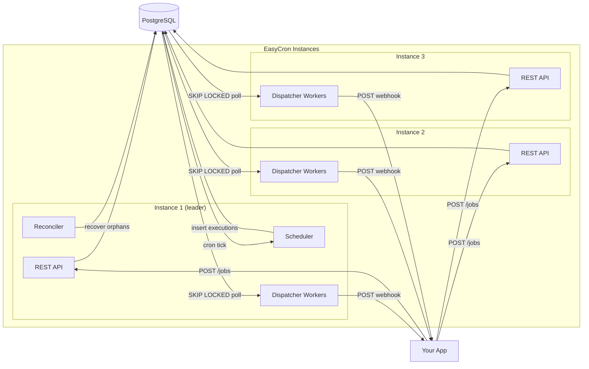

# EasyCron

**Schedule HTTP webhooks with cron expressions. No SDK, no queue, no complexity.**

[](https://go.dev)
[](LICENSE)

EasyCron is a self-hosted cron-as-a-service. POST a job with a cron expression and a webhook URL — EasyCron fires HTTP callbacks on schedule with HMAC-signed payloads, automatic retries, and Prometheus metrics.

## Architecture



1. Register jobs via the REST API (any instance)
2. Instances compete for a Postgres advisory lock — exactly one becomes **leader**
3. The leader's **Scheduler** inserts executions into Postgres on each tick
4. **Dispatcher workers** on all instances poll Postgres with `SKIP LOCKED` to claim and deliver webhooks
5. The leader's **Reconciler** recovers stalled executions
6. If the leader dies, a follower takes over within seconds

> **Single-instance mode:** Set `DISPATCH_MODE=channel` (default) for an in-memory Event Bus instead of DB polling. Simpler, but no horizontal scaling.

## Quick Start

```bash
docker compose up
```

Create a job:

```bash
curl -X POST http://localhost:8080/jobs \
  -H "Content-Type: application/json" \
  -d '{
    "name": "test-job",
    "cron_expression": "* * * * *",
    "timezone": "UTC",
    "webhook_url": "https://httpbin.org/post",
    "webhook_secret": "my-secret"
  }'
```

Check executions:

```bash
curl http://localhost:8080/jobs/{job_id}/executions
```

<details>
<summary>Manual setup (without Docker)</summary>

```bash
go build -o easycron ./cmd/easycron
createdb easycron
psql easycron < schema/001_initial.sql
psql easycron < schema/003_add_claimed_at.sql
export DATABASE_URL="postgres://localhost/easycron?sslmode=disable"
./easycron serve
```
</details>

## Configuration

All configuration is via environment variables. Run `./easycron --help` for the full list.

| Variable | Default | Description |
|----------|---------|-------------|
| `DATABASE_URL` | *required* | PostgreSQL connection string |
| `HTTP_ADDR` | `:8080` | Listen address |
| `TICK_INTERVAL` | `30s` | Scheduler polling interval |
| `DISPATCH_MODE` | `channel` | `channel` (in-memory) or `db` (Postgres polling) |
| `DISPATCHER_WORKERS` | `1` | Concurrent dispatch workers (DB mode) |
| `RECONCILE_ENABLED` | `false` | Enable orphan recovery (**set `true` in production**) |
| `METRICS_ENABLED` | `false` | Enable Prometheus `/metrics` endpoint |
| `CIRCUIT_BREAKER_THRESHOLD` | `5` | Consecutive failures before circuit opens (0 = disabled) |

## API

| Method | Path | Description |
|--------|------|-------------|
| `GET` | `/health` | Health check (`?verbose=true` for components) |
| `POST` | `/jobs` | Create a job |
| `GET` | `/jobs` | List jobs (`?limit=&offset=`) |
| `GET` | `/jobs/{id}/executions` | List executions |
| `DELETE` | `/jobs/{id}` | Delete a job |

### Webhook Delivery

Each fired job sends a POST with HMAC-signed payload:

```
X-EasyCron-Event-ID: <attempt-uuid>
X-EasyCron-Execution-ID: <execution-uuid>
X-EasyCron-Signature: <hmac-sha256-hex>
```

**Retries:** 4 attempts with backoff (immediate → 30s → 2m → 10m). Retryable: 5xx, 429, network errors. Non-retryable: 4xx.

**Circuit breaker:** After 5 consecutive failures per URL, delivery is short-circuited until cooldown expires.

Use `X-EasyCron-Execution-ID` for idempotency in your handler.

<details>
<summary>Signature verification (Go)</summary>

```go
func verifySignature(secret string, body []byte, signature string) bool {
    mac := hmac.New(sha256.New, []byte(secret))
    mac.Write(body)
    expected := hex.EncodeToString(mac.Sum(nil))
    return hmac.Equal([]byte(expected), []byte(signature))
}
```
</details>

## Horizontal Scaling

Run multiple instances against the same Postgres for HA. Requires `DISPATCH_MODE=db`.

- **Leader election** via Postgres advisory lock — one instance runs scheduler + reconciler
- **All instances** dispatch webhooks and serve the API
- **Automatic failover** within seconds if the leader dies

```bash
# Key env vars (same on all instances):
DISPATCH_MODE=db
LEADER_LOCK_KEY=728379
RECONCILE_ENABLED=true
METRICS_ENABLED=true
```

Validate with the HA test harness: `./scripts/ha_test.sh`

> See the [Operator Guide](OPERATORS.md#horizontal-scaling-multi-instance-ha) for tuning, failover timing, and alerting rules.

## Production Checklist

- [ ] `RECONCILE_ENABLED=true`
- [ ] `METRICS_ENABLED=true`
- [ ] Webhook handlers are idempotent
- [ ] Alert on `easycron_orphaned_executions > 0`

> Full details: [Operator Guide](OPERATORS.md)

## CLI

| Command | Description |
|---------|-------------|
| `easycron serve` | Start server |
| `easycron validate` | Validate config (exit 0/2) |
| `easycron config` | Print effective config (secrets masked) |
| `easycron version` | Print version |

## License

[MIT](LICENSE)
