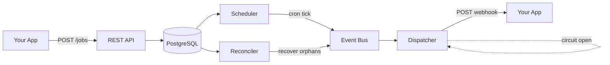

# EasyCron

**Schedule HTTP webhooks with cron expressions. No SDK, no queue, no complexity.**

[](https://go.dev)
[](LICENSE)

EasyCron is a self-hosted cron-as-a-service. POST a job with a cron expression and a webhook URL — EasyCron fires HTTP callbacks on schedule with HMAC-signed payloads, automatic retries, and Prometheus metrics.

## Why EasyCron?

| | System cron + curl | pg_cron | Managed services (AWS EventBridge, GCP Scheduler) | **EasyCron** |
|---|---|---|---|---|
| **Setup** | Config files on each server | PostgreSQL extension | Cloud console / IaC | REST API |
| **Webhook delivery** | Manual | No built-in HTTP | Yes | Yes, with HMAC signing |
| **Retries** | Manual | No | Varies | 4 attempts with backoff |
| **Observability** | DIY | pg_stat | Cloud metrics | Prometheus metrics |
| **Portability** | Tied to host | Tied to PostgreSQL | Tied to cloud vendor | Self-hosted, any infra |
| **Multi-app** | One crontab per host | One DB per cluster | Per-account | One instance, many apps |

**Use EasyCron when you need:**
- Scheduled HTTP callbacks without building your own scheduler
- Webhook delivery with retry logic and signature verification
- A single service that multiple applications can register jobs with
- Prometheus-native observability for your scheduled tasks
- Infrastructure you own and control (no vendor lock-in)

## Architecture



**How it works:**
1. Your application registers jobs via the REST API
2. The **Scheduler** checks PostgreSQL every tick (default 30s) for jobs due to fire
3. Fired executions are sent to an in-memory **Event Bus**
4. The **Dispatcher** delivers webhooks with HMAC signatures and retries failures
5. A per-URL **Circuit Breaker** skips dispatch to endpoints with repeated failures, re-probing after a cooldown
6. The optional **Reconciler** recovers executions that were lost (crash, buffer full)

> **DB Dispatch Mode:** Set `DISPATCH_MODE=db` to have workers poll Postgres directly via `SELECT ... FOR UPDATE SKIP LOCKED` instead of using the in-memory Event Bus. This eliminates the channel as a single point of failure and supports multiple worker goroutines (`DISPATCHER_WORKERS`).

## Quick Start

### Option 1: Docker Compose (recommended)

```bash
docker compose up
```

This starts PostgreSQL with the schema applied and EasyCron ready to accept jobs on `http://localhost:8080`.

### Option 2: Manual Setup

**Prerequisites:** Go 1.23+, PostgreSQL

1. Build:
```bash
go build -o easycron ./cmd/easycron
```

2. Start PostgreSQL and create a database:
```bash
createdb easycron
psql easycron < schema/001_initial.sql
psql easycron < schema/003_add_claimed_at.sql
```

3. Run:
```bash
export DATABASE_URL="postgres://localhost/easycron?sslmode=disable"
./easycron serve
```

4. Verify:
```bash
curl http://localhost:8080/health
# {"status":"ok"}
```

### Try It Out

Create a job that fires every minute:

```bash
curl -X POST http://localhost:8080/jobs \
  -H "Content-Type: application/json" \
  -d '{
    "name": "test-job",
    "cron_expression": "* * * * *",
    "timezone": "UTC",
    "webhook_url": "https://httpbin.org/post",
    "webhook_secret": "my-secret"
  }'
```

Check executions after a minute:

```bash
curl http://localhost:8080/jobs/{job_id}/executions
```

> **Tip:** Use [webhook.site](https://webhook.site) or [httpbin.org/post](https://httpbin.org/post) as a test webhook receiver to see payloads arrive in real time.

## Configuration

All configuration is via environment variables. See [`.env.example`](.env.example) for a complete reference.

### Essential Variables

| Variable | Required | Default | Description |
|----------|----------|---------|-------------|
| `DATABASE_URL` | Yes | - | PostgreSQL connection string |
| `HTTP_ADDR` | No | `:8080` | HTTP server listen address |
| `TICK_INTERVAL` | No | `30s` | Scheduler polling interval |
| `CIRCUIT_BREAKER_THRESHOLD` | No | `5` | Consecutive failures before circuit opens (0 = disabled) |
| `CIRCUIT_BREAKER_COOLDOWN` | No | `2m` | Cooldown before allowing a probe attempt |
| `DISPATCH_MODE` | No | `channel` | Dispatch mode: `channel` (in-memory) or `db` (Postgres polling) |
| `DB_POLL_INTERVAL` | No | `500ms` | Sleep between DB polls when idle (DB mode only) |
| `DISPATCHER_WORKERS` | No | `1` | Concurrent dispatch workers (DB mode only) |
| `REDIS_ADDR` | No | - | Redis address for analytics (optional) |

### Behavior

- Missing `DATABASE_URL`: Server refuses to start (exit code 2)
- Invalid `TICK_INTERVAL`: Server refuses to start (exit code 2)
- Missing `REDIS_ADDR`: Analytics disabled, server runs normally
- Validate config without starting: `./easycron validate`

> For the full list of environment variables (database pool, timeouts, metrics, reconciler), see [`.env.example`](.env.example) or run `./easycron --help`.

## Production Checklist

Before deploying to production, ensure:

- [ ] **`RECONCILE_ENABLED=true`** — Without this, executions lost to crashes or buffer overflows are never recovered
- [ ] **`METRICS_ENABLED=true`** — Required for observability and alerting
- [ ] **Alert on `easycron_eventbus_buffer_saturation > 0.8`** — Event loss is imminent when the buffer fills
- [ ] **Alert on `easycron_orphaned_executions > 0`** — Orphaned executions need investigation
- [ ] **Webhook handlers are idempotent** — Duplicate deliveries will occur; use `X-EasyCron-Execution-ID` for deduplication

> Read the full [Operator Guide](OPERATORS.md) for failure modes, capacity limits, and monitoring setup.

## API Usage

### Create a Job

```bash
curl -X POST http://localhost:8080/jobs \
  -H "Content-Type: application/json" \
  -d '{
    "name": "hourly-report",
    "cron_expression": "0 * * * *",
    "timezone": "America/New_York",
    "webhook_url": "https://example.com/webhook",
    "webhook_secret": "your-secret-key"
  }'
```

Response:
```json
{
  "id": "550e8400-e29b-41d4-a716-446655440000",
  "project_id": "00000000-0000-0000-0000-000000000001",
  "name": "hourly-report",
  "enabled": true,
  "cron_expression": "0 * * * *",
  "timezone": "America/New_York",
  "webhook_url": "https://example.com/webhook",
  "created_at": "2024-01-15T10:30:00Z"
}
```

### Validation

The API validates:
- `name`: Required
- `cron_expression`: Required, must be valid 5-field cron syntax
- `timezone`: Required, must be valid IANA timezone
- `webhook_url`: Required, must be http or https with valid host
- `webhook_timeout_seconds`: Optional, 1-60 (default 30)

**Note:** Webhook timeout must be between 1 and 60 seconds. Requests exceeding the timeout are retried (up to 4 attempts total).

Invalid requests return HTTP 400 with error message.

### List Jobs

```bash
curl http://localhost:8080/jobs
```

### List Executions

```bash
curl http://localhost:8080/jobs/{job_id}/executions
```

### Webhook Delivery

When a job fires, EasyCron sends a POST request to the configured webhook URL:

```http
POST /webhook HTTP/1.1
Host: example.com
Content-Type: application/json
X-EasyCron-Event-ID: <attempt-uuid>
X-EasyCron-Execution-ID: <execution-uuid>
X-EasyCron-Signature: <hmac-sha256-hex>

{
  "job_id": "550e8400-e29b-41d4-a716-446655440000",
  "execution_id": "660e8400-e29b-41d4-a716-446655440001",
  "scheduled_at": "2024-01-15T11:00:00Z",
  "fired_at": "2024-01-15T11:00:02Z"
}
```

#### Signature Verification

The `X-EasyCron-Signature` header contains an HMAC-SHA256 signature of the request body, computed using the job's `webhook_secret`. To verify:

```go
import (
    "crypto/hmac"
    "crypto/sha256"
    "encoding/hex"
)

func verifySignature(secret string, body []byte, signature string) bool {
    mac := hmac.New(sha256.New, []byte(secret))
    mac.Write(body)
    expected := hex.EncodeToString(mac.Sum(nil))
    return hmac.Equal([]byte(expected), []byte(signature))
}
```

#### Header Descriptions

| Header | Description |
|--------|-------------|
| `X-EasyCron-Event-ID` | Unique ID for this delivery attempt (changes on each retry) |
| `X-EasyCron-Execution-ID` | Unique ID for the scheduled execution (same across retries) |
| `X-EasyCron-Signature` | HMAC-SHA256 signature for verification |

Use `X-EasyCron-Execution-ID` for idempotency checks in your webhook handler.

#### Retry Behavior

Failed deliveries are retried with stepped backoff (fixed intervals, not exponential):
- Attempt 1: Immediate
- Attempt 2: After 30 seconds
- Attempt 3: After 2 minutes
- Attempt 4: After 10 minutes

Retryable failures: 5xx responses, 429 (rate limit), network errors.
Non-retryable: 4xx responses (except 429).

After 4 failed attempts, the execution is marked as `failed`.

#### Circuit Breaker

If a webhook URL fails 5 consecutive executions (configurable via `CIRCUIT_BREAKER_THRESHOLD`), the dispatcher opens a circuit breaker for that URL. While open, new executions for that URL are immediately marked `failed` without making HTTP calls. After a cooldown period (`CIRCUIT_BREAKER_COOLDOWN`, default 2m), one probe attempt is allowed. If it succeeds, the circuit closes and normal delivery resumes. If it fails, the circuit re-opens.

Set `CIRCUIT_BREAKER_THRESHOLD=0` to disable.

## Integration Modes

EasyCron runs in single-tenant mode with a fixed project ID. Each application should run its own EasyCron instance.

### Sidecar (Local/Dev)

Run EasyCron alongside your application:

```bash
# Terminal 1: Your application
./your-app

# Terminal 2: EasyCron
DATABASE_URL="postgres://localhost/easycron" ./easycron serve
```

Your application registers jobs via `http://localhost:8080/jobs`.

### Standalone (Shared Service)

Deploy EasyCron as a shared service. Multiple applications register jobs via the API. Each application receives webhooks at its configured URL.

### What Another Repository Needs

To integrate with EasyCron, your application needs:

1. HTTP client to call the EasyCron API
2. HTTP endpoint to receive webhooks
3. (Optional) HMAC verification for webhook authenticity

No SDK required. No special dependencies. HTTP only.

## CLI Commands

| Command | Description |
|---------|-------------|
| `easycron serve` | Start the scheduler, dispatcher, and HTTP API server. This is the main command. |
| `easycron validate` | Validate all environment variables without making any connections. Useful in CI or pre-deploy checks. Exits 0 if valid, 2 if not. |
| `easycron config` | Print the effective configuration as JSON with secrets masked. Useful for debugging what values are active. |
| `easycron version` | Print the version and git commit hash (set at build time via `-ldflags`). |
| `easycron --help` | Show usage and the full list of environment variables. |

## API Endpoints

| Method | Path | Description |
|--------|------|-------------|
| `GET` | `/health` | Health check. Returns `{"status":"ok"}`. Add `?verbose=true` for component-level status. |
| `POST` | `/jobs` | Create a new scheduled job. See [Create a Job](#create-a-job) for the request body. |
| `GET` | `/jobs` | List all jobs. Supports `?limit=` and `?offset=` for pagination. |
| `GET` | `/jobs/{id}/executions` | List executions for a job. Supports `?limit=` and `?offset=` for pagination. |
| `DELETE` | `/jobs/{id}` | Delete a job by ID. |

## Building

```bash
go build -o easycron ./cmd/easycron
```

With version injection:
```bash
go build -ldflags "-X main.version=v1.0.0 -X main.commit=$(git rev-parse --short HEAD)" ./cmd/easycron
```

## License

See [LICENSE](LICENSE) file.
